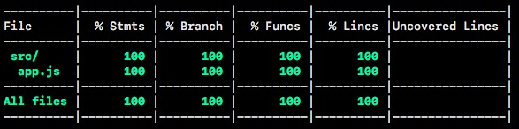

# AGL Developer Programming Challenge

This is a sample code to consume a json hosted at [ http://agl-developer-test.azurewebsites.net/people.json]( http://agl-developer-test.azurewebsites.net/people.json) and output a list of all the cats in alphabetical order under a heading of the gender of their owner.

Example:

```yml
Male
- Angel
- Molly
- Tigger

Female
- Gizmo
- Jasper

```

## Scripts

```bash
# to install node modules (to be done once)
npm install

# to run the project
npm start

# to run test suites
npm test

# to create build
npm run build

# to run test cases in watch mode
npm run tdd
```

## Tools used

This project is written using the following tools:

- JavaScript [`ES2015`](https://babeljs.io/learn-es2015/) version
- [`Webpack 2.x`](https://webpack.js.org/) as module bundler
- [`Babel JS`](https://babeljs.io/) as the compiler.
- [`Mocha JS`](https://mochajs.org/) testing framework.
- [`Chai JS`](http://chaijs.com/) as the assertion library
- [`Istanbul JS`](https://istanbul.js.org/) as the code coverage library

## Coverage

To get coverage report

```bash
npm run test
```



HTML Report can be accessed from [here](./coverage/index.html)